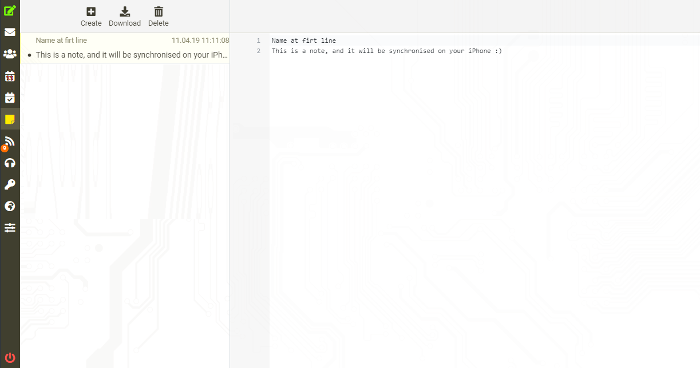

# [IMAP_Notes on RoundCube](https://github.com/gloony/roundcube_imap_notes)

Manage your iOS Notes on RoundCube

**This plugin work only with RoundCube 1.4+ and with elastic skin**

# Installation

```
Install this content into your_roundcube_root/plugins/imap_notes/
```

# ToDo

```
Search menu
Rewrite the code, it is actually ugly and I miss some previous part from my port of another of my extension
Optimization
```

# Screenshots



# OpenSource used

[elastic by roundcube](https://github.com/roundcube/elastic)
